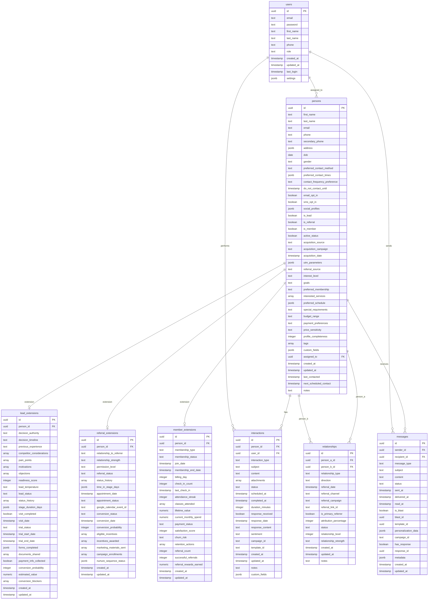

# ORCA Database Schema Documentation

This document provides a detailed overview of the ORCA application's database schema, designed according to the unified person model approach described in the project requirements.

## Entity Relationship Diagram

## Key Design Principles

### Unified Person Model
- All contacts (leads, referrals, members) are stored in the central `persons` table
- Role-based flags (`is_lead`, `is_referral`, `is_member`) determine the person's role(s)
- Extension tables contain role-specific data

### Extension Pattern
- Extension tables (`lead_extensions`, `referral_extensions`, `member_extensions`) store specialized data
- Each extension links to exactly one person via a foreign key relationship
- Extensions are only created when needed for the person's role(s)

### Relationship Tracking
- The `relationships` table models connections between people
- This supports the referral network visualization
- Multiple referrer relationships are possible through this structure
- Bidirectional relationships can be represented

## Foreign Key Relationships

1. **User to Person**
   - A user can be assigned to many persons
   - Each person can be assigned to one user (through `assigned_to`)

2. **Person to Extensions**
   - One person can have one lead extension
   - One person can have one referral extension
   - One person can have one member extension
   - All extension tables have a CASCADE delete relationship with their person

3. **Person to Relationships**
   - A person can have many relationships as either person_a or person_b
   - Self-referential relationship pattern allows network visualization

4. **Person to Interactions**
   - A person can have many interactions
   - A user can perform many interactions

5. **Person to Messages**
   - A user can send many messages
   - A person can receive many messages

## Common Data Patterns

### Status History Tracking
- Status changes are tracked in `status_history` arrays
- Each entry includes status, timestamp, and notes
- This allows tracking a person's journey through the pipeline

### JSONB Fields
- Complex data is stored in JSONB fields for flexibility
- Examples: address, preferences, custom fields
- Allows schema evolution without migrations for some data types

### Timestamps
- All major entities have created_at and updated_at timestamps
- Activity-specific timestamps track when actions occurred

## Query Optimization

The database is optimized for:

1. **Person Filtering**
   - Indexes on role flags (`is_lead`, `is_referral`, `is_member`)
   - Indexes on assignment and status fields

2. **Relationship Queries**
   - Composite indexes for relationship lookup
   - Optimization for network traversal

3. **Interaction Queries**
   - Indexes on person_id and scheduled_at
   - Allows efficient timeline views

## Database Views

While the physical schema uses the extension pattern, application code can use views for simplified access:

- `leads_view`: Combines person and lead_extension data
- `referrals_view`: Combines person and referral_extension data
- `members_view`: Combines person and member_extension data

These views make it easier to work with the unified model without repeated joins. 