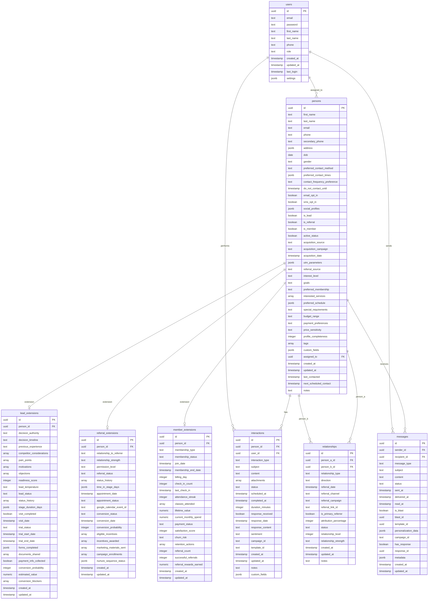

# Entity Relationship Diagram

This document provides a visual representation of the Entity Relationship Diagram for the ORCA database.

## Database Schema Visualization

## Relationship Explanations

### One-to-Many Relationships

1. **User to Person (`assigned_to`)**: 
   - Each person can be assigned to one user
   - Each user can be assigned many persons

2. **Person to Interactions (`has`)**: 
   - Each person can have many interactions
   - Each interaction belongs to one person

3. **User to Interactions (`performs`)**: 
   - Each user can perform many interactions
   - Each interaction is performed by one user

4. **Person to Messages (`receives`)**: 
   - Each person can receive many messages
   - Each message is received by one person

5. **User to Messages (`sends`)**: 
   - Each user can send many messages
   - Each message is sent by one user

6. **Person to Relationships (`person_a` and `person_b`)**: 
   - Each person can participate in many relationships
   - Each relationship connects exactly two persons

### One-to-One Relationships

1. **Person to Lead Extension (`extension`)**: 
   - Each person can have one lead extension
   - Each lead extension belongs to one person

2. **Person to Referral Extension (`extension`)**: 
   - Each person can have one referral extension
   - Each referral extension belongs to one person

3. **Person to Member Extension (`extension`)**: 
   - Each person can have one member extension
   - Each member extension belongs to one person

## Key Design Patterns

1. **Unified Person Model**: All contacts (leads, referrals, members) are stored in the central `persons` table with flags to indicate their roles.

2. **Extension Pattern**: Role-specific data is stored in separate extension tables to keep the core persons table clean.

3. **Bidirectional Relationships**: The relationships table allows for complex network modeling with direction indicators.

4. **Comprehensive Time Tracking**: Almost all entities track creation, update, and activity timestamps for audit purposes. 